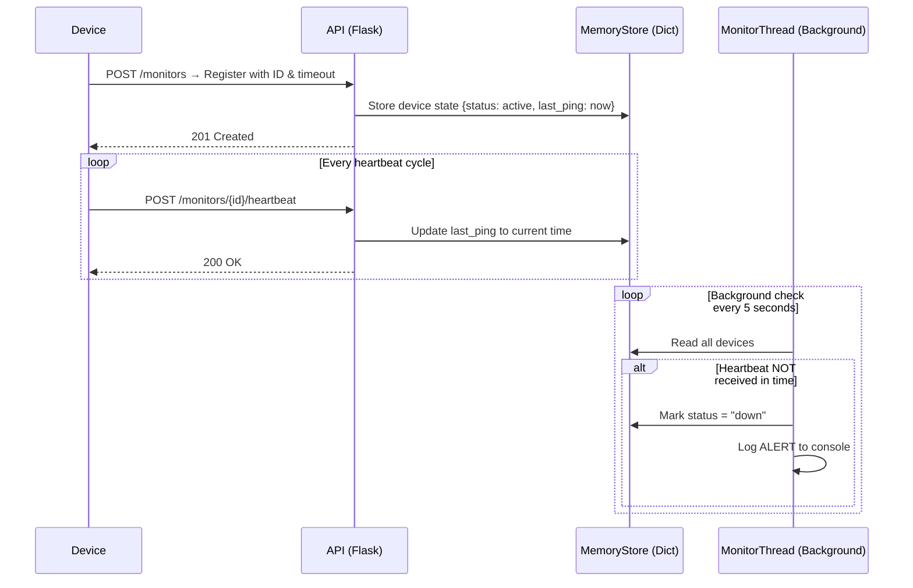

# Pulse Check API — Watchdog Sentinel

A **Dead Man's Switch API** built for CritMon Servers Inc. to monitor remote devices like solar farms and unmanned weather stations. If a device stops sending heartbeat signals within its configured timeout window, the system automatically triggers an alert.

---

## Architecture Diagram



**How the system works at a glance:**

1. A device registers itself with a unique ID and a timeout (in seconds)
2. The device must keep sending heartbeats before the timeout runs out
3. A background thread silently checks all devices every 5 seconds
4. If a device misses its deadline — an alert fires and its status flips to `"down"`

---

## Setup Instructions

### Prerequisites

- Python 3.7 or higher
- pip (Python package manager)

### Installation

```bash
# 1. Clone the repository
git clone https://github.com/YOUR_USERNAME/pulse-check-api.git
cd pulse-check-api

# 2. Install the only dependency
pip install flask

# 3. Start the server
python app.py
```

The API will start on `http://127.0.0.1:5000` by default.

---

## API Documentation

### Base URL

```
http://localhost:5000
```

---

### 1. Health Check

Check that the server is running.

**`GET /`**

**Response:**
```
Pulse Check API is running
```

---

### 2. Register a Monitor

Create a new monitor for a device. This starts the countdown timer.

**`POST /monitors`**

**Request Body:**
```json
{
  "id": "device-123",
  "timeout": 60
}
```

| Field     | Type    | Description                                      |
|-----------|---------|--------------------------------------------------|
| `id`      | string  | Unique identifier for the device                 |
| `timeout` | integer | Seconds before an alert fires without a heartbeat|

**Success Response — `201 Created`:**
```json
{
  "message": "Monitor device-123 registered",
  "data": {
    "timeout": 60,
    "last_ping": 1710000000.123,
    "status": "active"
  }
}
```

---

### 3. Send a Heartbeat

Reset the countdown timer for a registered device. Call this before the timeout runs out.

**`POST /monitors/{device_id}/heartbeat`**

**Example:**
```
POST /monitors/device-123/heartbeat
```

**Success Response — `200 OK`:**
```json
{
  "message": "Heartbeat received from device-123",
  "data": {
    "timeout": 60,
    "last_ping": 1710000060.456,
    "status": "active"
  }
}
```

**Device Not Found — `404 Not Found`:**
```json
{
  "error": "Monitor not found"
}
```

---

### 4. Get All Monitors

View the current state of all registered devices.

**`GET /monitors`**

**Response — `200 OK`:**
```json
{
  "device-123": {
    "timeout": 60,
    "last_ping": 1710000060.456,
    "status": "active"
  },
  "weather-station-7": {
    "timeout": 120,
    "last_ping": 1709999900.000,
    "status": "down"
  }
}
```

---

### Alert System

When a device's timer expires (no heartbeat received in time), the background monitor logs this to the console:

```json
{
  "ALERT": "Device device-123 is down!",
  "time": 1710000120.789
}
```

The device's `status` field is also updated to `"down"` in the monitor store.

---

## Developer's Choice — GET /monitors Endpoint

### What was added

A `GET /monitors` endpoint that returns the current status of all registered devices.

### Why it was added

The original spec only covers registration, heartbeat, and alerting — but there is no way to *inspect* the system without it. In a real monitoring scenario, a support engineer needs to:

- See which devices are registered at a glance
- Verify a device came back online after repairs
- Check how long ago a device last pinged (via `last_ping` timestamp)
- Distinguish between `active` and `down` devices without reading server logs

Without this endpoint, the API is essentially a black box. Adding read access to the monitor store makes the system observable, which is a core principle of production-grade infrastructure tooling.

---

## Project Structure

```
pulse-check-api/
├── app.py          # Main application — all routes and background monitor logic
├── README.md       # Project documentation (this file)
└── .gitignore      # Excludes __pycache__, .env, and editor files
```

---

## Technologies Used

| Technology         | Purpose                                                  |
|--------------------|----------------------------------------------------------|
| **Python**         | Primary programming language                             |
| **Flask**          | Lightweight web framework for building the REST API      |
| **threading**      | Built-in Python module for running the background monitor|
| **time**           | Built-in Python module for tracking heartbeat timestamps |
| **In-memory dict** | Simple key-value store for device state (no database)    |

---

## Design Decisions

- **No database** — Device state is stored in a Python dictionary in memory. This keeps setup simple and is appropriate for a demo/assessment context. In production, Redis or a SQL database would be used for persistence across restarts.
- **Background thread** — A daemon thread runs alongside the Flask server and checks device timeouts every 5 seconds. It is a daemon so it shuts down cleanly when the main process exits.
- **Console alerting** — Alerts are printed to the server console as JSON. This simulates a webhook or email notification that would be used in production.
